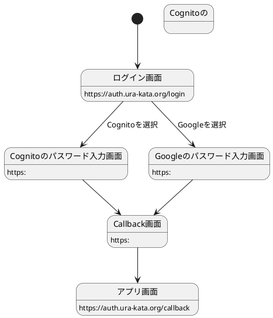

# 認証について



## JWT について

### Cognito id token payload

```json
{
  "at_hash": "hash",
  "sub": "uuid",
  "aud": "xxxxxxxxxxxxxxxxxxxxxxxxxx",
  "email_verified": true,
  "event_id": "uuid",
  "token_use": "id",
  "auth_time": 1615204833,
  "iss": "https://cognito-idp.region.amazonaws.com/region_XXXxxx0",
  "cognito:username": "username",
  "exp": 1615208433,
  "iat": 1615204833,
  "email": "example@example.com"
}
```

### Cognito access token payload

```json
{
  "sub": "uuid",
  "event_id": "uuid",
  "token_use": "access",
  "scope": "openid email",
  "auth_time": 1615204833,
  "iss": "https://cognito-idp.region.amazonaws.com/region_XXXxxx0",
  "exp": 1615208433,
  "iat": 1615204833,
  "version": 2,
  "jti": "uuid",
  "client_id": "cognito_client_id",
  "username": "username"
}
```

### Google id token payload

```json
{
  "at_hash": "hash",
  "sub": "uuid",
  "cognito:groups": [
    "region_XXXXxxxx0_Google"
  ],
  "email_verified": false,
  "iss": "https://cognito-idp.region.amazonaws.com/region_XXXXxxxx0",
  "cognito:username": "google_000000000000000000000",
  "nonce": "123523",
  "aud": "xxxxxxxxxxxxxxxxxxxxxxxxxx",
  "identities": [
    {
      "userId": "000000000000000000000",
      "providerName": "Google",
      "providerType": "Google",
      "issuer": null,
      "primary": "true",
      "dateCreated": "1615202663831"
    }
  ],
  "token_use": "id",
  "auth_time": 1615202663,
  "exp": 1615206263,
  "iat": 1615202664,
  "email": "example@example.com"
}
```

### Google access token payload

```json
{
  "sub": "uuid",
  "cognito:groups": [
    "region_XXXXxxxx0_Google"
  ],
  "token_use": "access",
  "scope": "openid profile email",
  "auth_time": 1615202663,
  "iss": "https://cognito-idp.region.amazonaws.com/region_XXXXxxxx0",
  "exp": 1615206263,
  "iat": 1615202664,
  "version": 2,
  "jti": "uuid",
  "client_id": "client_id",
  "username": "google_000000000000000000000"
}
```
