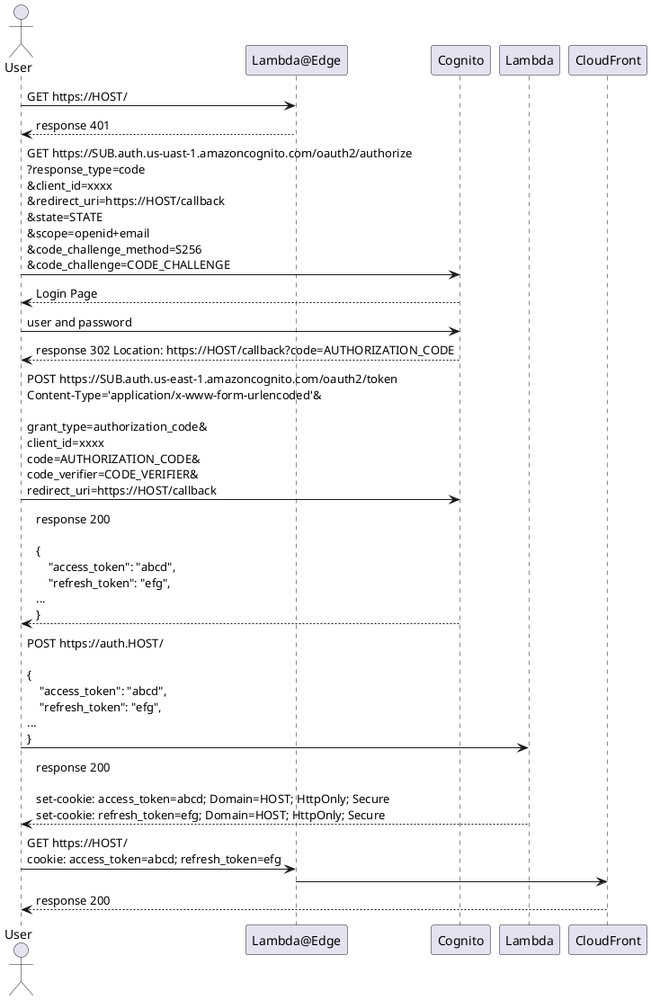

# アーキテクチャ

## Cognito の認証について

```plantuml
@startuml
actor User

User -> Lambda@Edge: GET https://HOST/
Lambda@Edge --> User: response 401

User -> Cognito: GET https://SUB.auth.us-uast-1.amazoncognito.com/oauth2/authorize\n?response_type=code\n&client_id=xxxx\n&redirect_uri=https://HOST/callback\n&state=STATE\n&scope=openid+email\n&code_challenge_method=S256\n&code_challenge=CODE_CHALLENGE
Cognito --> User: Login Page

User -> Cognito: user and password
Cognito --> User: response 302 Location: https://HOST/callback?code=AUTHORIZATION_CODE

User -> Cognito: POST https://SUB.auth.us-east-1.amazoncognito.com/oauth2/token\nContent-Type='application/x-www-form-urlencoded'&\n\ngrant_type=authorization_code&\nclient_id=xxxx\ncode=AUTHORIZATION_CODE&\ncode_verifier=CODE_VERIFIER&\nredirect_uri=https://HOST/callback
Cognito --> User: response 200\n\n{\n    "access_token": "abcd",\n    "refresh_token": "efg",\n...\n}

User -> Lambda: POST https://auth.HOST/\n\n{\n    "access_token": "abcd",\n    "refresh_token": "efg",\n...\n}
Lambda --> User: response 200\n\nset-cookie: access_token=abcd; Domain=HOST; HttpOnly; Secure\nset-cookie: refresh_token=efg; Domain=HOST; HttpOnly; Secure

User -> Lambda@Edge: GET https://HOST/\ncookie: access_token=abcd; refresh_token=efg
Lambda@Edge -> CloudFront
CloudFront --> User: response 200
@enduml
```
